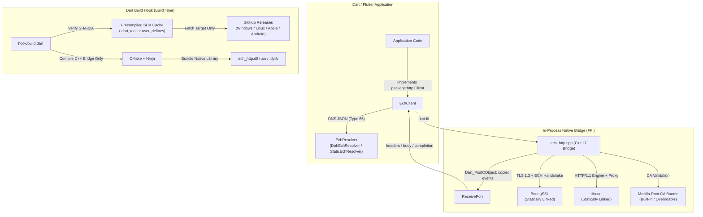

# ech_http

[](https://dart.dev)
[](https://flutter.dev)
[](#supported-platforms-and-toolchain)
[](LICENSE)
[-green.svg)](https://datatracker.ietf.org/doc/draft-ietf-tls-esni/)

[简体中文](README.zh-CN.md)

An enterprise-grade, `package:http`-compatible client for Dart and Flutter with native support for **TLS Encrypted Client Hello (ECH)**, HTTP CONNECT proxies, custom PKI trust roots, and streaming transfers.

Powered by an in-process C++17 engine built on **libcurl** and **BoringSSL**, bundled seamlessly through Dart's modern build hooks (`code_assets`). **No background daemons, local listening proxies, Flutter platform channel plugins, or manual DLL loading required at runtime.**

---

## Architecture Overview



Each native request worker posts copied response events to a Dart `ReceivePort`
through
[`NativeApi.postCObject`](https://api.dart.dev/dart-ffi/NativeApi/postCObject.html)
without polling or `NativeCallable`. Stream pauses withhold acknowledgements,
limiting unconsumed native body data to 256 KiB per request.

Cancellation stops posting and releases the request handle without waiting for
network I/O. Workers retain their state until exit; native finalizers handle
unreachable objects and isolate-group teardown. Close clients explicitly for
prompt cleanup.

---

## Key Features & Security Principles

- **Fail-Closed by Design**: If an `EchRoute` is configured for a destination, ECH negotiation **must** succeed. If the server does not support ECH, rejects the handshake, or presents an unusable configuration, the request fails immediately. **There is never a silent fallback to cleartext SNI.**
- **Authenticated ECH Retries**: Supports up to 2 automated ECH retries when the server responds with a valid TLS `retry_configs` rejection. Public names are strictly validated before retrying.
- **Separation of Destination Routing and SNI**: IP address overrides (`addresses`) redirect only the underlying TCP socket or proxy CONNECT tunnel. The TLS inner SNI, certificate identity verification, and HTTP `Host` header always correspond to the original requested hostname.
- **Strict TLS Verification**: Every connection strictly validates the server's certificate chain and hostname against the bundled Mozilla CA root certificates. There is **no insecure mode** or certificate bypass switch. Custom PKI roots can be explicitly loaded via `trustedRootsPem`.
- **High-Performance Build Hooks**: Build hooks (`hook/build.dart`) automatically download verified precompiled dependency SDKs for the exact target platform, compiling only the lightweight C++ bridge locally (~15 s cold build). No need to compile BoringSSL or libcurl from scratch.
- **Zero Runtime Daemons**: Communicates directly through Dart FFI within the host process memory space, avoiding child processes, socket proxy bottlenecks, and OS port conflicts.

---

## Supported Platforms and Toolchain

| Target Platform | Configured Architectures | Build Host Requirements | Minimum OS Baseline |
| :--- | :--- | :--- | :--- |
| **Windows** | `x64`, `arm64`, `ia32` | Windows host, Visual Studio 2022+ C++ build tools, CMake, Ninja | Windows 10+ / Server 2016+ |
| **Linux** | `x64`, `arm64` | Linux host, `build-essential`, `cmake`, `ninja-build` | glibc >= 2.35, GCC 11+ libstdc++ |
| **macOS** | `x64`, `arm64` | macOS host, Xcode Command Line Tools, CMake, Ninja | macOS 10.15+ (x64) / 11.0+ (arm64) |
| **iOS** | `arm64` (device), `arm64`/`x64` (simulator) | macOS host, Xcode, CMake, Ninja | iOS 13.0+ |
| **Android** | `arm64-v8a`, `armeabi-v7a`, `x86_64`, `x86` | Android NDK r28.2+ (or Flutter bundled NDK), CMake, Ninja | Android API level 21+ (5.0 Lollipop) |

> [!NOTE]
> Web (Browsers) and native HarmonyOS are not currently supported. Android binaries link against static libc++ and use 16 KiB ELF segment alignment for Android 15 compatibility.

---

## Getting Started

### 1. Installation

Add `ech_http` to your application's `pubspec.yaml`:

```yaml
dependencies:
  ech_http: ^0.1.1
  http: ^1.6.0
```

Run `dart pub get` (or `flutter pub get`).

### 2. Basic Request with Dynamic DoH Discovery

For hosts that publish ECH configurations in their DNS HTTPS records (RFC 9460), use `DohEchResolver`:

```dart
import 'package:ech_http/ech_http.dart';
import 'package:http/http.dart' as http;

Future<void> main() async {
  final target = Uri.parse('https://crypto.cloudflare.com/cdn-cgi/trace');
  final dohEndpoint = Uri.parse('https://cloudflare-dns.com/dns-query');

  // 1. Create a bootstrap client for DNS queries
  final bootstrap = EchClient();

  // 2. Configure the main client with DoH resolver
  final client = EchClient(
    resolver: DohEchResolver(
      client: bootstrap,
      endpoint: dohEndpoint,
      hosts: {target.host},
    ),
  );

  try {
    final response = await client.send(http.Request('GET', target));
    print('HTTP ${response.statusCode}');
    print('ECH Accepted: ${response.echAccepted}');
    print('Authenticated Retries: ${response.echRetries}');

    final body = await response.stream.bytesToString();
    print('Response:\n$body');
  } finally {
    // Always close clients when finished to release native resources
    client.close();
    bootstrap.close();
  }
}
```

### 3. Static Route & IP Overrides (Custom CDN Routing)

When using pre-distributed ECH configurations or connecting to specific origin/edge IPs:

```dart
import 'package:ech_http/ech_http.dart';
import 'package:http/http.dart' as http;

Future<void> main() async {
  // Base64-encoded ECHConfigList
  const echConfig = 'AED+DQA85wAgACD...AAA=';

  final client = EchClient(
    resolver: StaticEchResolver({
      'my-service.example': EchRoute(
        configList: echConfig,
        // Traffic routes directly to these IPs; SNI and Host header remain 'my-service.example'
        addresses: ['198.51.100.10', '198.51.100.11'],
      ),
    }),
  );

  try {
    final response = await client.get(Uri.parse('https://my-service.example/api/v1'));
    print('Status: ${response.statusCode}');
  } finally {
    client.close();
  }
}
```

### 4. HTTP CONNECT Proxy

Pass the `proxy` URI to both the bootstrap client and application client:

```dart
final proxyUri = Uri.parse('http://127.0.0.1:7890');

final bootstrap = EchClient(proxy: proxyUri);
final client = EchClient(
  proxy: proxyUri,
  resolver: DohEchResolver(
    client: bootstrap,
    endpoint: dohEndpoint,
    hosts: {'my-service.example'},
  ),
);
```

> [!IMPORTANT]
> `EchClient` does not automatically inspect OS proxy settings or environment variables (`HTTP_PROXY`, `ALL_PROXY`). You must configure the `proxy` parameter explicitly.

---

## Offline Builds & Binary Caching

By default, Dart build hooks download precompiled dependency SDKs on the first build and cache them under `.dart_tool`. For CI/CD environments or reproducible offline builds, configure a shared binary cache directory in your application's `pubspec.yaml`:

```yaml
hooks:
  user_defines:
    ech_http:
      binary_cache: .dart_tool/ech_http_dependencies
```

- Paths are relative to the consuming project's `pubspec.yaml`.
- The build hook verifies the SHA-256 checksum of downloaded archives against `lib/src/build_support/dependencies.json`.
- Cached archives are validated on each build; any damaged or modified extracted files are automatically repaired from the cached archive.

---

## Operational Limits & Design Constraints

| Parameter / Feature | Default | Description |
| :--- | :--- | :--- |
| **Protocol** | `HTTP/1.1` | HTTP/2 and HTTP/3 are not supported in this release. |
| **Max Concurrent Requests** | `6` | Native connection queue concurrency limit per client instance. |
| **Max Response Size** | `32 MiB` | Maximum incoming stream body size; aborts if exceeded. |
| **Max Upload Size** | `8 MiB` | Upload streams are fully buffered into native memory before dispatching. |
| **Request Timeout** | `30 s` | Per-destination attempt timeout (covers DNS connection, TLS handshake, ECH retries, and data streaming). |
| **Connect Timeout** | `10 s` | TCP connection and initial TLS handshake timeout. |
| **Compression** | Manual | No automatic `gzip` / `br` decompression. Request uncompressed data or decompress in Dart. |
| **Address Failover** | Supported | Automatically fails over across `addresses` for `GET` and `HEAD` requests before receiving headers. |
| **Redirect Security** | Enforced | Rejects HTTPS-to-HTTP downgrades. Strips `Authorization`, `Cookie`, and `Host` on cross-origin redirects. |

---

## In-Depth Documentation

- [Routing & ECH Discovery](doc/routing.md) - Deep dive into DoH resolution, provider shared configurations, IP overrides, and redirect policies.
- [Testing & Release Preparation](doc/releasing.md) - Guide for local validation, live end-to-end tests, environment variables, and pub.dev publication.
- [Platform Verification Matrix](doc/verification.md) - Breakdown of tested platforms, CI matrix execution, binary footprint, and known constraints.
- [Third-Party Notices](THIRD_PARTY_NOTICES.md) - Open-source licenses for libcurl, BoringSSL, Mozilla CA bundle, and Android libc++.

---

## Local Development & Testing

```sh
# Fetch dependencies
dart pub get

# Code formatting and static analysis
dart format --output=none --set-exit-if-changed lib hook test example tool
dart analyze --fatal-infos

# Run unit and offline mock tests (31 tests)
dart test -r expanded

# Dry-run package publication
dart pub publish --dry-run
```

For live testing with real ECH endpoints, see [doc/releasing.md](doc/releasing.md#optional-live-checks).

---

## License

This project is licensed under the [MIT License](LICENSE). Third-party dependencies (libcurl, BoringSSL, Mozilla CA bundle) are licensed under their respective licenses documented in [THIRD_PARTY_NOTICES.md](THIRD_PARTY_NOTICES.md).
