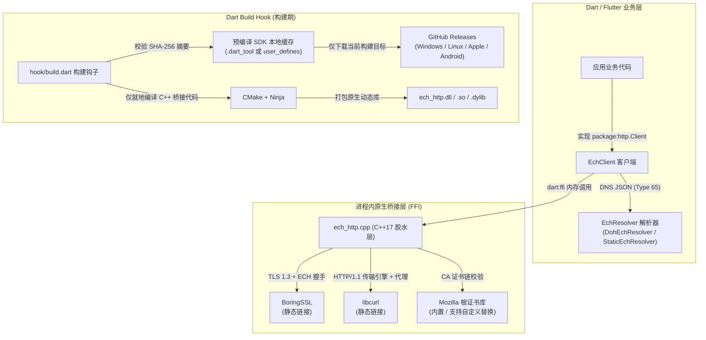

# ech_http

[](https://dart.dev)
[](https://flutter.dev)
[](#支持平台与工具链)
[](LICENSE)
[-green.svg)](https://datatracker.ietf.org/doc/draft-ietf-tls-esni/)

[English](README.md)

`ech_http` 是专为 Dart 和 Flutter 打造的企业级 HTTP 客户端，深度集成了 **TLS 密文客户端问候（Encrypted Client Hello, ECH）**、HTTP CONNECT 代理、自定义 PKI 信任根及流式数据传输功能。完全兼容官方 `package:http.Client` 接口规范。

底层核心由基于 **libcurl** 和 **BoringSSL** 构建的 C++17 原生引擎驱动，通过 Dart 现代构建钩子（Build Hooks / `code_assets`）实现跨平台自动打包。**在运行时，无需启动任何外部后台进程、无需部署本地监听代理、无需注册 Flutter 平台插件通道，也无需应用层手动管理动态链接库加载。**

---

## 架构总览



---

## 核心特性与安全设计准则

- **Fail-Closed 闭门失败原则**：若目标域名配置了 `EchRoute`，则 ECH 握手**必须成功**。若服务端不支持 ECH、握手被拒绝或返回无法解析的配置，请求将立即终止并抛出异常。**绝对不会静默回退降级至明文 SNI。**
- **原生支持认证重试（Authenticated Retry）**：当服务端返回合法的 TLS `retry_configs`（配置拒绝重试）时，客户端会自动进行最多 2 次认证重试。重试前会严格校验外层公用名（Public Name）以防篡改。
- **物理路由与证书身份严格解耦**：自定义目标 IP 地址列表（`addresses`）仅重定向底层的 TCP Socket 物理连接或代理 CONNECT 隧道；TLS 握手中的内层 SNI、服务端证书主体身份核验以及 HTTP `Host` 请求头始终保持原始目标域名不变。
- **严格证书校验，无旁路后门**：所有连接默认基于内置的 Mozilla CA 根证书库严格验证证书链与主机名。**库中未设置任何跳过证书验证的不安全开关**。如需使用企业私有 PKI，可通过 `trustedRootsPem` 显式替换信任根。
- **极速构建钩子机制**：借助 Dart `hook/build.dart`，在首次构建时按需拉取对应平台的预编译 SDK，本地仅需编译轻量级的 C++ 桥接代码（冷构建仅约 15 秒），无需在本地完整编译庞大的 BoringSSL 与 libcurl。
- **零外部守护进程**：直接在应用主进程内存中通过 Dart FFI 调用原生接口，避免了子进程开销、本地端口占用冲突及系统级代理注入风险。

---

## 支持平台与工具链

| 目标平台 | 配置架构 | 构建机要求 | 最低系统基线 |
| :--- | :--- | :--- | :--- |
| **Windows** | `x64`, `arm64`, `ia32` | Windows 系统, Visual Studio 2022+ C++ 构建工具, CMake, Ninja | Windows 10+ / Server 2016+ |
| **Linux** | `x64`, `arm64` | Linux 系统, `build-essential`, `cmake`, `ninja-build` | glibc >= 2.35, GCC 11+ libstdc++ |
| **macOS** | `x64`, `arm64` | macOS 系统, Xcode Command Line Tools, CMake, Ninja | macOS 10.15+ (x64) / 11.0+ (arm64) |
| **iOS** | `arm64` (真机), `arm64`/`x64` (模拟器) | macOS 系统, Xcode, CMake, Ninja | iOS 13.0+ |
| **Android** | `arm64-v8a`, `armeabi-v7a`, `x86_64`, `x86` | Android NDK r28.2+ (或 Flutter 自带 NDK), CMake, Ninja | Android API Level 21+ (5.0 Lollipop) |

> [!NOTE]
> 当前暂不支持浏览器 Web 环境及原生鸿蒙（HarmonyOS）。Android 原生库使用静态 libc++ 链接，并满足 Android 15 强制要求的 16 KiB ELF 页面对齐。

---

## 快速上手

### 1. 添加依赖

在项目的 `pubspec.yaml` 中引入 `ech_http`：

```yaml
dependencies:
  ech_http: ^0.1.1
  http: ^1.6.0
```

执行命令获取依赖：`dart pub get`（或 `flutter pub get`）。

### 2. 基于 DoH 的动态 ECH 发现

对于已在 DNS HTTPS 记录（RFC 9460）中发布 ECH 信息的域名，可直接使用 `DohEchResolver`：

```dart
import 'package:ech_http/ech_http.dart';
import 'package:http/http.dart' as http;

Future<void> main() async {
  final target = Uri.parse('https://crypto.cloudflare.com/cdn-cgi/trace');
  final dohEndpoint = Uri.parse('https://cloudflare-dns.com/dns-query');

  // 1. 创建用于 DNS 查询的引导客户端
  final bootstrap = EchClient();

  // 2. 配置主业务客户端并挂载 DoH 解析器
  final client = EchClient(
    resolver: DohEchResolver(
      client: bootstrap,
      endpoint: dohEndpoint,
      hosts: {target.host},
    ),
  );

  try {
    final response = await client.send(http.Request('GET', target));
    print('HTTP 状态码: ${response.statusCode}');
    print('ECH 握手接受状态: ${response.echAccepted}');
    print('认证重试次数: ${response.echRetries}');

    final body = await response.stream.bytesToString();
    print('响应正文:\n$body');
  } finally {
    // 释放客户端与原生资源
    client.close();
    bootstrap.close();
  }
}
```

### 3. 静态配置与 IP 覆盖直连（CDN 节点加速与指定路由）

当您持有预先下发的 ECH 配置，或需要指定边缘 CDN 物理节点时：

```dart
import 'package:ech_http/ech_http.dart';
import 'package:http/http.dart' as http;

Future<void> main() async {
  // Base64 编码的 ECHConfigList
  const echConfig = 'AED+DQA85wAgACD...AAA=';

  final client = EchClient(
    resolver: StaticEchResolver({
      'my-service.example': EchRoute(
        configList: echConfig,
        // 物理连接直接发送至指定 IP，SNI 与 HTTP Host 依然保留为 'my-service.example'
        addresses: ['198.51.100.10', '198.51.100.11'],
      ),
    }),
  );

  try {
    final response = await client.get(Uri.parse('https://my-service.example/api/v1'));
    print('状态码: ${response.statusCode}');
  } finally {
    client.close();
  }
}
```

### 4. 配合 HTTP CONNECT 代理使用

使用代理时，需将代理地址同时传入引导客户端与主业务客户端：

```dart
final proxyUri = Uri.parse('http://127.0.0.1:7890');

final bootstrap = EchClient(proxy: proxyUri);
final client = EchClient(
  proxy: proxyUri,
  resolver: DohEchResolver(
    client: bootstrap,
    endpoint: dohEndpoint,
    hosts: {'my-service.example'},
  ),
);
```

> [!IMPORTANT]
> `EchClient` 不会自动读取操作系统的系统代理设置或环境变量（如 `HTTP_PROXY`、`ALL_PROXY`）。若需走代理，必须显式配置 `proxy` 参数。

---

## 离线构建与二进制缓存配置

默认情况下，构建钩子会在首次构建时自动下载所需的依赖 SDK 并缓存在 `.dart_tool` 目录下。在 CI/CD 流水线或离线隔离环境中，可以在消费方项目的 `pubspec.yaml` 中指定持久化的共享缓存目录：

```yaml
hooks:
  user_defines:
    ech_http:
      binary_cache: .dart_tool/ech_http_dependencies
```

- 配置路径相对于使用该库的 `pubspec.yaml`。
- 构建钩子会依据 `hook/dependencies.json` 中的 SHA-256 散列严格核验下载档案的完整性。
- 每次构建都会校验解压文件；若本地解压文件损坏或被修改，钩子会自动基于缓存的压缩包进行自愈修复。

---

## 运行指标与设计约束

| 参数 / 机制 | 默认值 | 详细说明 |
| :--- | :--- | :--- |
| **HTTP 协议版本** | `HTTP/1.1` | 当前版本专注于稳定高兼容传输，暂未启用 HTTP/2 和 HTTP/3。 |
| **最大并发请求数** | `6` | 每个客户端实例底层的原生并发队列上限，多余请求将进入有序等待队列。 |
| **单请求响应体积限制** | `32 MiB` | 最大单次响应流体积，超出将抛出异常以防内存溢出。 |
| **单请求上传体积限制** | `8 MiB` | 上传数据流在发送前会完整缓冲至原生内存，不适用于超大文件流式直传。 |
| **总体请求超时 (`timeout`)** | `30 秒` | 单个物理目标地址的总体耗时上限（包含连接、TLS 握手、ECH 重试及数据传输）。 |
| **连接超时 (`connectTimeout`)** | `10 秒` | 底层 TCP 连接与初始 TLS 握手的超时上限。 |
| **内容解压** | 手动处理 | 原生层不进行自动 `gzip` 或 `brotli` 解压，建议按需在 Dart 层解码。 |
| **地址自动故障转移** | 已支持 | 针对 `GET` 和 `HEAD` 请求，在收到 HTTP 响应头之前，若首选 IP 失败将自动顺次尝试 `addresses` 中的备用 IP。 |
| **重定向安全防御** | 强制执行 | 严禁 HTTPS 降级至 HTTP 明文；跨域重定向时会自动剥离 `Authorization`、`Cookie` 及 `Host` 凭据头。 |

---

## 深入技术文档

- [路由与 ECH 发现机制](doc/routing.zh-CN.md) - 深入探讨 DoH 查询机制、服务商共享 ECH 配置（如 Cloudflare 共享节点）、IP 覆盖直连及重定向安全策略。
- [本地验证与发布指南](doc/releasing.zh-CN.md) - 开发调试、端到端 Live 真实网络测试、环境变量参数表及 pub.dev 发布指南。
- [平台验证记录与兼容性矩阵](doc/verification.zh-CN.md) - 平台 CI 矩阵测试覆盖、运行时真实设备验证、二进制体积与构建性能开销。
- [第三方开源协议声明](THIRD_PARTY_NOTICES.md) - libcurl、BoringSSL、Mozilla CA 证书包及 Android libc++ 的合规授权声明。

---

## 本地开发与测试

```sh
# 安装依赖
dart pub get

# 代码格式化与静态语法分析
dart format --output=none --set-exit-if-changed lib hook test example tool
dart analyze --fatal-infos

# 运行全套离线单元测试（包含 31 项测试）
dart test -r expanded

# 模拟发布打包检查
dart pub publish --dry-run
```

针对真实公网端点的 ECH 动态联调，请参阅 [doc/releasing.zh-CN.md](doc/releasing.zh-CN.md#可选的-live-真实网络测试)。

---

## 开源协议

本项目基于 [MIT 许可证](LICENSE) 发布。内置与链接的第三方组件（libcurl、BoringSSL、Mozilla CA 证书包）遵循各自的原生开源协议，详见 [THIRD_PARTY_NOTICES.md](THIRD_PARTY_NOTICES.md)。
