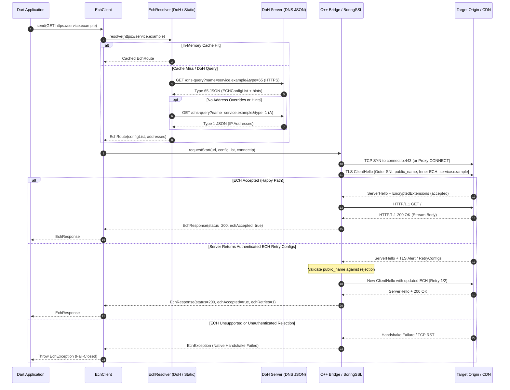
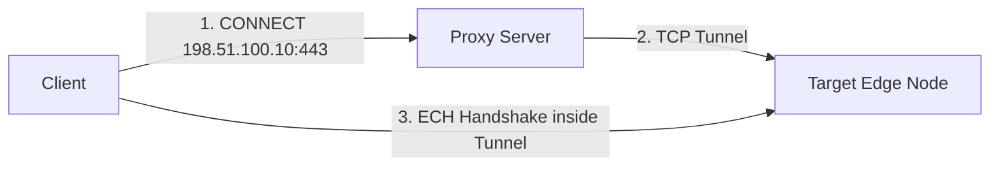

# Routing and ECH Discovery Guide

[简体中文](routing.zh-CN.md) | [English](routing.md)

This document provides a comprehensive guide on how `ech_http` resolves domain names, discovers TLS Encrypted Client Hello (ECH) configurations, manages physical TCP/proxy routing, and enforces TLS security policies.

---

## Architectural Principles

1. **Explicit Routing by Application Policy**: The application retains complete control over which HTTPS authorities require ECH, which use standard verified TLS, and which endpoints route through proxies. The library intentionally does **not** hardcode vendor-specific domain lists, CDN IP databases, or auto-discovery heuristics.
2. **Decoupled Identity and Physical Transport**: When you supply explicit destination IP addresses (`addresses` or `addressOverrides`), they redirect **only** the physical TCP socket or HTTP CONNECT tunnel. The TLS inner SNI, certificate validation identity, and HTTP `Host` header remain strictly bound to the requested URL.
3. **Fail-Closed Security**: If an `EchRoute` is matched for a request, ECH negotiation **must** succeed. If the server does not support ECH or rejects the handshake, the request is terminated immediately. It will **never** silently fall back to cleartext SNI.

---

## Resolution & Handshake Lifecycle



---

## 1. Hosts Publishing Their Own ECH Configuration

Domains that natively support RFC 9460 publish an HTTPS DNS record (RR type 65) containing an `ech` parameter with a base64-encoded `ECHConfigList`.

Use `DohEchResolver` with a dedicated, isolated bootstrap client:

```dart
import 'package:ech_http/ech_http.dart';
import 'package:http/http.dart' as http;

Future<void> requestSelfPublishedHost() async {
  final target = Uri.parse('https://crypto.cloudflare.com/cdn-cgi/trace');
  final dohEndpoint = Uri.parse('https://cloudflare-dns.com/dns-query');

  // Separate bootstrap client for resolving DNS queries
  final bootstrap = EchClient();

  final client = EchClient(
    resolver: DohEchResolver(
      client: bootstrap,
      endpoint: dohEndpoint,
      hosts: {target.host},
      maxCacheAge: const Duration(minutes: 5),
    ),
  );

  try {
    final response = await client.get(target);
    print('Status: ${response.statusCode}');
  } finally {
    client.close();
    bootstrap.close();
  }
}
```

### Technical Nuances of `DohEchResolver`
- **DNS JSON Protocol**: The `endpoint` must support Google / Cloudflare style DNS JSON over HTTPS (`Accept: application/dns-json`). Standard raw wire-format RFC 8484 endpoints are not directly compatible.
- **Port Scope**: Dynamic DoH discovery is scoped to HTTPS on standard port 443. Non-standard ports must use `StaticEchResolver` or a custom resolver.
- **Concurrent Coalescing**: If multiple concurrent requests target the same unresolved domain, `DohEchResolver` coalesces them into a single flight, preventing DNS query storms.
- **TTL Caching**: Caches responses respecting DNS TTL (clamped by `maxCacheAge`). Call `resolver.clearCache()` if network conditions switch (e.g., Wi-Fi to cellular).
- **Bootstrap Client Isolation**: Never pass `resolver` to the `bootstrap` client itself; doing so would trigger infinite recursion during DNS lookup.

---

## 2. Hosts Using Shared Provider ECH Configurations

In many real-world CDN deployments (such as Cloudflare CDN or Amazon CloudFront), edge nodes accept ECH for all hosted customer domains under a shared provider configuration, even if a specific origin domain does not publish an HTTPS RR type 65 record on its own authority (e.g., observed with `lain.bgm.tv`).

You can configure `configDomains` to borrow the ECH configuration from a verified reference domain, combined with `addressOverrides` for the actual destination IPs:

```dart
final resolver = DohEchResolver(
  client: bootstrap,
  endpoint: trustedDnsJsonEndpoint,
  hosts: {'custom-customer.example'},
  // Borrow the provider's valid ECH configuration
  configDomains: {
    'custom-customer.example': 'cloudflare.com',
  },
  // Route to the actual destination edge IPs for custom-customer.example
  addressOverrides: {
    'custom-customer.example': [
      '104.20.0.1',
      '104.20.0.2',
    ],
  },
);
```

> [!IMPORTANT] Critical Safety Rules for Shared Configurations
> 1. **Destination Address Isolation**: IP hints from the borrowed `configDomains` record are **intentionally ignored**. You must provide `addressOverrides` targeting the real service, or allow `DohEchResolver` to resolve the original host's A records.
> 2. **No Blind Brand Assumptions**: A shared configuration is an implementation-specific feature of certain CDN edge infrastructures, not a universal protocol guarantee. Never infer ECH compatibility solely from domain suffixes or CDN brand names. Always verify experimentally.
> 3. **Identity Remains Authentic**: The TLS handshake inner SNI and HTTP `Host` header remain `custom-customer.example`. The server certificate must match `custom-customer.example`.

---

## 3. Static & Manual ECH Route Configurations

If your application retrieves ECH configurations through an out-of-band control plane, hardcodes pins, or connects to non-standard ports:

```dart
final client = EchClient(
  resolver: StaticEchResolver({
    'api.secure.internal': EchRoute(
      // Base64 ECHConfigList
      configList: 'AED+DQA85wAgACD...AAA=',
      // Concrete IP endpoints
      addresses: ['192.0.2.42', '198.51.100.99'],
    ),
  }),
);
```

### Writing a Custom `EchResolver`

For advanced architectures (such as path-based policies, dynamic tokenized gateways, or strict zero-trust rules), implement the `EchResolver` interface directly:

```dart
class EnterpriseZeroTrustResolver implements EchResolver {
  final Map<String, EchRoute> _allowedEchRoutes;

  EnterpriseZeroTrustResolver(this._allowedEchRoutes);

  @override
  Future<EchRoute?> resolve(Uri uri) async {
    final host = uri.host.toLowerCase();
    
    // 1. Check if the domain is explicitly registered for ECH
    if (_allowedEchRoutes.containsKey(host)) {
      return _allowedEchRoutes[host];
    }
    
    // 2. Return null to permit standard verified TLS for specific subdomains
    if (host.endsWith('.public-fallback.example')) {
      return null;
    }
    
    // 3. Reject all other destinations (enforce strict whitelist)
    throw EchException('Access to unapproved HTTPS host rejected by policy: $host', uri: uri);
  }
}
```

---

## 4. Proxies, IP Overrides, and Privacy Boundaries

Understanding what ECH protects—and what it does **not** protect—is vital for robust security engineering:

| Transport Layer | Without ECH | With ECH (`ech_http`) |
| :--- | :--- | :--- |
| **Destination IP Address** | Exposed to ISP / Network Path | Exposed to ISP / Network Path (unless using an encrypted proxy) |
| **TLS Outer SNI (Public Name)**| Real Domain Name Exposed | Generic Provider Name (e.g. `cloudflare-ech.com`) |
| **TLS Inner SNI (Target Host)**| Real Domain Name Exposed | **Encrypted** inside TLS 1.3 ClientHello payload |
| **Certificate Identity** | Server Cert Subject exposed | **Encrypted** in TLS 1.3 ServerHello |
| **HTTP Request Headers & Body** | Encrypted in TLS | **Encrypted** in TLS |

### HTTP CONNECT Proxy Guidelines

When configuring `proxy: Uri.parse('http://proxy.example:8080')`:



> [!WARNING]
> - If `addresses` is supplied in `EchRoute`, the proxy receives an **IP literal** in the `CONNECT` request (e.g. `CONNECT 104.20.0.1:443 HTTP/1.1`), completely hiding the target domain name from the proxy.
> - If `addresses` is omitted or empty, libcurl delegates domain resolution to the proxy (e.g. `CONNECT service.example:443 HTTP/1.1`), which **discloses the target domain name** to the proxy operator.

---

## 5. Redirects and Cross-Origin Security

`EchClient` adheres to strict security defaults when following HTTP redirects:

1. **Refusal of HTTPS Downgrade**: If an HTTPS request receives a redirect (`301`, `302`, `303`, `307`, `308`) pointing to an insecure `http://` URL, the client throws `ClientException('HTTPS downgrade redirect refused')`.
2. **Cross-Origin Credential Stripping**: If the target redirect URI has a different origin (`uri.origin != next.origin`), sensitive headers are automatically purged:
   - `Authorization`
   - `Cookie`
   - `Proxy-Authorization`
   - `Host`
3. **Independent Resolver Evaluation**: The new redirect URL is processed independently by your `EchResolver`. If the redirect target host is not configured in the resolver (returning `null`), it will proceed with standard verified TLS. If your application demands ECH across all hops, validate every host within your resolver.

---

## 6. OS Permissions and Entitlements

Ensure the consuming application has configured the required platform capabilities:

- **Android**: Add `<uses-permission android:name="android.permission.INTERNET" />` to `AndroidManifest.xml`.
- **macOS**: Enable the network client entitlement in your `.entitlements` file:
  ```xml
  <key>com.apple.security.network.client</key>
  <true/>
  ```
- **iOS**: Standard Internet outbound access is permitted by default. If connecting to a local proxy (e.g. `192.168.x.x`), iOS may require the Local Network Privacy permission.
