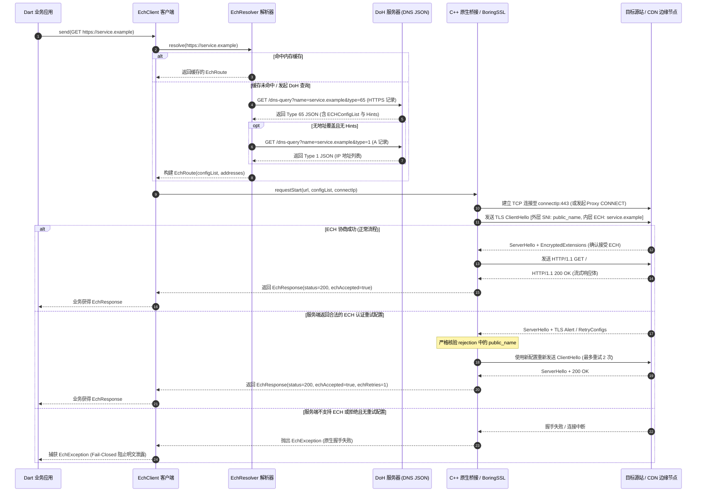
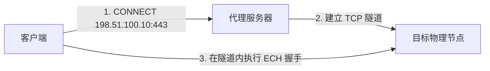

# 路由与 ECH 发现机制技术指南

[English](routing.md) | [简体中文](routing.zh-CN.md)

本指南深入介绍 `ech_http` 如何解析域名、动态发现 TLS 密文客户端问候（Encrypted Client Hello, ECH）配置、管理底层 TCP/代理物理路由，并执行严格的 TLS 安全策略。

---

## 核心架构准则

1. **应用策略完全显式控制**：应用层对哪些 HTTPS 主机必须使用 ECH、哪些回退使用普通验证 TLS、哪些流量经由代理路由拥有绝对控制权。本库**不内置**任何针对特定商业服务商的域名白名单、CDN 固定 IP 列表或猜测性的探测逻辑。
2. **物理传输与证书身份严格解耦**：当在路由中指定目标 IP 列表（`addresses` 或 `addressOverrides`）时，该配置**仅且只**改变底层 TCP 套接字的物理目标或 HTTP CONNECT 代理隧道的连接端点。TLS 握手阶段的内层 SNI、服务端证书主体校验及 HTTP `Host` 请求头始终严格绑定为原始请求域名。
3. **Fail-Closed 闭门失败原则**：凡是通过 `EchRoute` 指定了 ECH 策略的主机，ECH 协商**必须成功**。如果服务端不支持 ECH、握手被拒绝或返回不可用的配置，请求将立即终止并抛出异常，**绝不静默降级为明文 SNI**。

---

## 解析与握手全生命周期



---

## 1. 自行发布 ECH 配置的域名

支持 RFC 9460 标准的域名会在其 DNS HTTPS 记录（RR Type 65）中携带 `ech` 参数（内含 Base64 编码的 `ECHConfigList`）。

此时应使用 `DohEchResolver` 并配合独立的引导客户端：

```dart
import 'package:ech_http/ech_http.dart';
import 'package:http/http.dart' as http;

Future<void> requestSelfPublishedHost() async {
  final target = Uri.parse('https://crypto.cloudflare.com/cdn-cgi/trace');
  final dohEndpoint = Uri.parse('https://cloudflare-dns.com/dns-query');

  // 1. 创建专门用于 DoH DNS 查询的独立引导客户端
  final bootstrap = EchClient();

  // 2. 配置主业务客户端
  final client = EchClient(
    resolver: DohEchResolver(
      client: bootstrap,
      endpoint: dohEndpoint,
      hosts: {target.host},
      maxCacheAge: const Duration(minutes: 5),
    ),
  );

  try {
    final response = await client.get(target);
    print('状态码: ${response.statusCode}');
  } finally {
    client.close();
    bootstrap.close();
  }
}
```

### `DohEchResolver` 的关键技术细节
- **DNS JSON 协议规范**：`endpoint` 必须支持 Google / Cloudflare 风格的 DNS JSON over HTTPS 协议（请求头含 `Accept: application/dns-json`）。纯二进制线格式（RFC 8484）端点暂不兼容。
- **端口支持范围**：动态 DoH 自动发现仅针对标准 443 端口的 HTTPS 服务。非标准端口请使用 `StaticEchResolver` 或自定义解析器。
- **并发请求去重（Coalescing）**：当短时间内有多个并发请求打向同一个未解析域名时，`DohEchResolver` 会自动合并为一个实际的 DoH 请求，避免 DNS 泛洪。
- **TTL 缓存与自适应失效**：解析结果遵循 DNS TTL 并在 `maxCacheAge` 限制内缓存。在网络切换（如 Wi-Fi 切换至蜂窝网络）时，可调用 `resolver.clearCache()` 手动清理。
- **引导客户端隔离**：切勿将同一个 `resolver` 传给 `bootstrap` 客户端本身，否则会导致递归死循环。

---

## 2. 使用服务商共享 ECH 配置的域名

在主流大型 CDN（如 Cloudflare CDN、AWS CloudFront）的部署架构中，边缘接入节点通常对该服务商托管的所有域名通用一套共享 ECH 配置，即使某些客户自有域名未单独在权威 DNS 配置 HTTPS Type 65 记录（业界知名实例如 `lain.bgm.tv`）。

调用方在自行完成兼容性验证后，可通过 `configDomains` 借用参考域名的 ECH 配置，并结合 `addressOverrides` 传入该服务经过验证的真实接入节点 IP：

```dart
final resolver = DohEchResolver(
  client: bootstrap,
  endpoint: trustedDnsJsonEndpoint,
  hosts: {'custom-customer.example'},
  // 借用该 CDN 服务商已验证有效的配置来源域名
  configDomains: {
    'custom-customer.example': 'cloudflare.com',
  },
  // 提供 custom-customer.example 真实的边缘物理节点 IP
  addressOverrides: {
    'custom-customer.example': [
      '104.20.0.1',
      '104.20.0.2',
    ],
  },
);
```

> [!IMPORTANT] 共享配置的关键安全原则
> 1. **物理目标地址必须隔离**：从 `configDomains` 获取到的配置记录中如果含有 IP Hints，**会被系统强制忽略**。调用方必须通过 `addressOverrides` 提供真实服务节点的 IP，或者交由解析器去查询原域名的 A 记录。
> 2. **切勿盲目按品牌假设兼容性**：共享 ECH 属于特定 CDN 基础架构的特定行为，并非 IETF 标准承诺。绝不能仅凭域名后缀或 CDN 厂商商标便主观推断支持，必须进行实测。
> 3. **证书与 Host 头保持本色**：握手阶段解密后的内层 SNI 与 HTTP `Host` 头依旧是 `custom-customer.example`，服务端出示的 TLS 证书也必须与 `custom-customer.example` 严格匹配。

---

## 3. 静态显式配置与自定义解析器

如果您的应用通过私有通道、下发配置列表、固定证书钉扎，或需要访问非标准端口：

```dart
final client = EchClient(
  resolver: StaticEchResolver({
    'api.secure.internal': EchRoute(
      // Base64 格式的 ECHConfigList
      configList: 'AED+DQA85wAgACD...AAA=',
      // 物理连接 IP 列表
      addresses: ['192.0.2.42', '198.51.100.99'],
    ),
  }),
);
```

### 编写自定义 `EchResolver`

对于更复杂的企业级网络治理（如基于路径的策略分流、零信任接入控制网关），可以直接实现 `EchResolver` 接口：

```dart
class EnterpriseZeroTrustResolver implements EchResolver {
  final Map<String, EchRoute> _allowedEchRoutes;

  EnterpriseZeroTrustResolver(this._allowedEchRoutes);

  @override
  Future<EchRoute?> resolve(Uri uri) async {
    final host = uri.host.toLowerCase();
    
    // 1. 若在显式 ECH 路由表中，返回强制 ECH 路由
    if (_allowedEchRoutes.containsKey(host)) {
      return _allowedEchRoutes[host];
    }
    
    // 2. 返回 null 表示允许对特定子域名降级使用标准的普通 TLS
    if (host.endsWith('.public-fallback.example')) {
      return null;
    }
    
    // 3. 拦截任何未在白名单中的未经授权域名
    throw EchException('安全策略拒绝未经许可的 HTTPS 主机访问: $host', uri: uri);
  }
}
```

---

## 4. 代理隧道、IP 覆盖与隐私保护边界

明确 ECH 能保护什么、不能保护什么是网络安全设计的基础：

| 传输与协议层 | 未启用 ECH | 启用 ECH (`ech_http`) |
| :--- | :--- | :--- |
| **目标物理 IP 地址** | 对 ISP / 路由器可见 | 对 ISP / 路由器可见（除非使用加密代理） |
| **TLS 外层 SNI (公开名称)**| 泄露真实目标域名 | 展现为通用公共域名（如 `cloudflare-ech.com`） |
| **TLS 内层 SNI (真实目标)**| 泄露真实目标域名 | **已加密**（封装在 TLS 1.3 ClientHello 密文中） |
| **服务端证书主体身份** | 随 ServerHello 明文泄露 | **已加密**（TLS 1.3 内层握手保护） |
| **HTTP 请求头及正文** | TLS 加密保护 | **TLS 加密保护** |

### HTTP CONNECT 代理行为细节

配置 `proxy: Uri.parse('http://proxy.example:8080')` 时：



> [!WARNING]
> - 若 `EchRoute` 中指定了 `addresses` IP，客户端向代理发起 CONNECT 时将直接使用 **IP 字面量**（如 `CONNECT 104.20.0.1:443 HTTP/1.1`），代理服务器完全无法获知您打算访问的真实域名。
> - 若未提供 `addresses`，底层 libcurl 会将域名直接委托给代理进行解析（如 `CONNECT service.example:443 HTTP/1.1`），**这会导致目标域名直接暴露给代理运营者**。

---

## 5. 重定向机制与跨域安全

在处理 HTTP 重定向时，`EchClient` 恪守严格的安全防范策略：

1. **拒绝 HTTPS 降级**：若原 HTTPS 请求重定向至不安全的 `http://` 明文链接，客户端会立刻中断并抛出 `ClientException('HTTPS downgrade redirect refused')`。
2. **跨域敏感凭据自动剥离**：当重定向目标具有不同的 Origin (`uri.origin != next.origin`) 时，以下敏感请求头会被立即剔除：
   - `Authorization`
   - `Cookie`
   - `Proxy-Authorization`
   - `Host`
3. **独立策略再评估**：重定向的目标 URI 会重新传入 `EchResolver` 进行评估。如果新域名在解析器中未配置（返回 `null`），则会转为使用普通验证 TLS。若业务要求所有跳转必须全程受 ECH 保护，请在解析器中严密校验每一个跳转目标。

---

## 6. 系统权限与网络配置

使用本库的应用需确保具备系统网络访问权限：

- **Android**：在 `AndroidManifest.xml` 中添加：
  ```xml
  <uses-permission android:name="android.permission.INTERNET" />
  ```
- **macOS**：在沙盒权限文件 `.entitlements` 中启用网络客户端权限：
  ```xml
  <key>com.apple.security.network.client</key>
  <true/>
  ```
- **iOS**：默认允许标准公网出站连接。若需连接局域网代理服务器（如 `192.168.x.x`），iOS 可能会弹出本地网络访问权限提示。
