# Platform Verification and Compatibility Record

[简体中文](verification.zh-CN.md) | [English](verification.md)

This document provides a detailed technical report of the multi-platform verification status, automated CI test coverage, binary footprint metrics, and known deployment boundaries for `ech_http`.

The event-delivery update was verified on Windows x64 / Dart 3.13.4: static
analysis and all 37 offline tests passed; 2 opt-in live tests were skipped.
Coverage includes timer-free delivery, delayed listeners, repeated pauses,
paused cancellation, bounded messages, closed ports, and active transfers during
isolate-group teardown. The native smoke tool also compiled and received a
terminal event. Interactive Flutter hot reload/restart has not been verified
for this update; the platform matrix below records earlier verification.

---

## 1. Multi-Platform Verification Matrix

We distinguish between three tiers of verification:
- **Tier 1 (Runtime Verified)**: The native bridge compiles, links, runs all unit/integration tests, and completes end-to-end network requests on real hardware or host runners.
- **Tier 2 (Build & Packaging Verified)**: The native bridge compiles and links successfully via Dart build hooks; app bundling (APK, framework) succeeds, but runtime execution on every physical device model is not fully tested.
- **Tier 3 (Out of Scope / Untested)**: Environments not supported by this architecture or not yet verified in automated pipelines.

| Platform | Architecture / Target | Verification Tier | Verification Details | Known Gaps / Boundary |
| :--- | :--- | :---: | :--- | :--- |
| **Windows** | `x64` | **Tier 1** | Native build hook, 31 offline tests, publication dry-run, live proxy & ECH test | Execution on legacy Windows versions prior to Windows 10 |
| **Windows** | `arm64`, `ia32` | **Tier 2** | Cross-compilation and bridge linking via MSVC 14.51 | Physical ARM64/IA32 Windows runtime execution |
| **Linux** | `x64`, `arm64` | **Tier 1** | Native build hooks, 31 offline tests, publication dry-run on Ubuntu runners | Linux distributions with `glibc < 2.35` or non-glibc (musl) |
| **macOS** | `x64` (Intel) | **Tier 1** | Native build hook, 31 offline tests, Flutter Debug application build | Signed App Store / notarized runtime execution |
| **macOS** | `arm64` (Apple Silicon) | **Tier 1** | Native build hook, 31 offline tests, Flutter Debug application build | Signed App Store / notarized runtime execution |
| **iOS** | `arm64` (Physical Device) | **Tier 2** | Bridge build, Flutter Release app build with `--no-codesign` | Signed device execution, TestFlight, App Store review |
| **iOS** | `arm64`, `x64` (Simulator) | **Tier 2** | Bridge build, Flutter simulator Debug app packaging | In-simulator runtime execution |
| **Android** | `arm64-v8a` | **Tier 1** | Physical device run (API 35), live ECH handshake, authenticated retry, connection reuse | Non-standard custom Android ROMs |
| **Android** | `armeabi-v7a`, `x86_64` | **Tier 2** | Flutter Debug APK packaging for both ABIs | Runtime execution on physical 32-bit ARM / x86_64 devices |
| **Android** | `x86` | **Tier 2** | Local NDK r30 bridge build and link check | 32-bit x86 Android runtime execution |
| **Web / HarmonyOS** | All | **Tier 3** | Not supported by this native C++ FFI architecture | N/A |

---

## 2. Precompiled SDK Release Registry

Precompiled dependency SDKs (statically built libcurl 8.22.0 + BoringSSL + zlib 1.3.2) are hosted in four dedicated public repositories:

| Build Repository | Release Tag | Target Platforms & Architectures |
| :--- | :--- | :--- |
| [libechhttp-win32-build](https://github.com/ech-research/libechhttp-win32-build) | `v0.1.1` | Windows: `x64`, `arm64`, `ia32` |
| [libechhttp-darwin-build](https://github.com/ech-research/libechhttp-darwin-build) | `v0.1.2` | macOS / iOS: `x64`, `arm64` (Device + Simulator) |
| [libechhttp-android-build](https://github.com/ech-research/libechhttp-android-build) | `v0.1.1` | Android: `arm64-v8a`, `armeabi-v7a`, `x86_64`, `x86` |
| [libechhttp-linux-build](https://github.com/ech-research/libechhttp-linux-build) | `v0.1.1` | Linux: `x64`, `arm64` |

All release archives and their SHA-256 digests are pinned in [lib/src/build_support/dependencies.json](../lib/src/build_support/dependencies.json).

---

## 3. Test Coverage Summary

```mermaid
flowchart TD
    subgraph OfflineSuite["Offline Unit & Integration Suite"]
        direction TB
        T1["HTTP Semantics\n(Status Codes, Headers, Streams, Limits)"]
        T2["Security & Redirects\n(HTTPS Downgrade Refusal, Cross-Origin Stripping)"]
        T3["Concurrency & Backpressure\n(Stream Pause/Resume, Queueing, Timeouts, Abort Triggers)"]
        T4["TLS & ECH Fail-Closed\n(Hostname Verification, PKI Isolation, Unusable Config Rejection)"]
        T5["Dependency SDK Integrity\n(Hash Verification, Path Traversal Defense, Offline Repair)"]
        T6["Gzip / IOClient Parity\n(Negotiation, Headers, Lengths, Multi-Member Streams, Decoded Limits)"]
    end

    subgraph LiveSuite["Live Public E2E Suite (Opt-In)"]
        direction TB
        L1["Real ECH Handshake\n(Cloudflare / CDN Edge Nodes)"]
        L2["Authenticated Retry\n(Handling Stale ECHConfig Rejections)"]
        L3["HTTP Proxy Tunneling\n(CONNECT via local or remote proxy)"]
        L4["Custom Root Isolation\n(Confirming Handshake Failure with Disjoint Roots)"]
    end
```

- **Offline Suite**: Fully self-contained within Dart; spins up local TLS test servers using the public test fixtures in `test/fixtures/`. Run via `dart test`.
- **Live Suite**: Executed against public HTTPS deployments with known ECH configurations. Demonstrated connection reuse across repeated requests without repeating initial ECH retry handshakes.

---

## 4. Performance & Binary Footprint

Observations recorded on standard developer environments:

### First-Build (Cold) Latency
On a fresh Windows workstation with no cached dependency SDK or native build cache:
- **Total Duration**: `15.48 seconds` (for `dart run example/ech_http_example.dart` after `dart pub get`).
- **Breakdown**:
  1. SDK Archive Download: ~3.5 s (depending on network)
  2. SHA-256 Verification & Extraction: ~1.2 s
  3. CMake Configuration: ~2.1 s
  4. C++ Bridge Compilation & Linking: ~8.6 s
- **Subsequent (Warm) Builds**: Incremental compilation of `ech_http.cpp` takes less than 1.5 seconds.

### Android Native Binary Characteristics
- **Stripped Binary Size (`libech_http.so`)**: Approximately `2.9 MiB` (Android arm64-v8a, release build).
- **ELF Segment Alignment**: Fully configured with **16 KiB page alignment** (`-Wl,-z,max-page-size=16384`), ensuring compliance with Android 15 (API 35) 16 KB page size requirements.
- **Dynamic Dependencies**: Dependent strictly on the standard C system libraries (`libc.so`, `libm.so`, `libdl.so`). The C++ standard runtime (`libc++`) is statically linked into the library.

---

## 5. Consumer Packaging & Distribution Guidelines

### Apple Platforms (macOS & iOS)
- **Codesigning**: In Flutter projects, Flutter's build toolchain automatically copies and signs the native `.dylib` inside the app bundle using the host project's provisioning profile and signing identities.
- **Sandboxing**: Sandboxed macOS applications require the `com.apple.security.network.client` entitlement.
- **XCFramework / Framework Export**: Packaging using `flutter build ios-framework` is not tested in the automated CI matrix.

### Android Platforms
- **ABI Filtering**: If your application targets only specific ABIs (e.g. `arm64-v8a` only), configure `ndk.abiFilters` in your app's `build.gradle` to exclude unused 32-bit architectures and reduce final APK download size.
