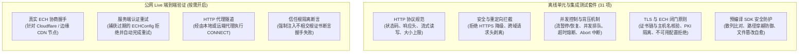

# 平台验证与兼容性技术记录

[English](verification.md) | [简体中文](verification.zh-CN.md)

本文件详细记录了 `ech_http` 的多平台验证状态、持续集成（CI）自动化测试覆盖率、底层二进制产物体积指标以及工程分发边界。

---

## 1. 多平台验证分级矩阵

我们将验证状态严格区分为三个技术等级：
- **Tier 1 (全功能运行时验证 - Runtime Verified)**：原生 C++ 胶水代码完成编译与链接，通过全套离线单元测试，且在真实物理设备或宿主系统运行器上成功完成公网端到端网络请求。
- **Tier 2 (编译与应用打包验证 - Build & Packaging Verified)**：通过 Dart 构建钩子成功拉取依赖、交叉编译及静态链接，在 Flutter 容器中完成 Debug/Release 应用归档打包（APK/Framework），但未在全部物理设备型号上进行全功能运行验证。
- **Tier 3 (架构外 / 暂不支持 - Out of Scope)**：本原生 FFI 架构当前未支持或未纳入自动化流水线验证的环境。

| 目标系统 | 目标架构 / ABI | 验证级别 | 验证详情 | 已知边界与暂未覆盖项 |
| :--- | :--- | :---: | :--- | :--- |
| **Windows** | `x64` | **Tier 1** | 原生 build hook、31 项离线测试、pub 发布 dry-run、真实代理与 ECH 请求 | Windows 10 之前的早期 Windows 版本 |
| **Windows** | `arm64`, `ia32` | **Tier 2** | 基于 MSVC 14.51 工具链的交叉编译与动态链接 | ARM64 / IA32 实体 Windows 机器运行时执行 |
| **Linux** | `x64`, `arm64` | **Tier 1** | 原生 build hook、31 项离线测试、Ubuntu 运行器完整测试通过 | `glibc < 2.35` 的老旧发行版或 Alpine (musl) |
| **macOS** | `x64` (Intel) | **Tier 1** | 原生 build hook、31 项离线测试、Flutter Debug 应用打包 | App Store 发行签名、Hardened Runtime 与公证 |
| **macOS** | `arm64` (Apple Silicon) | **Tier 1** | 原生 build hook、31 项离线测试、Flutter Debug 应用打包 | App Store 发行签名、Hardened Runtime 与公证 |
| **iOS** | `arm64` (真机) | **Tier 2** | 桥接编译通过，Flutter Release `--no-codesign` 打包成功 | 签名真机运行、TestFlight 分发及 App Store 审核 |
| **iOS** | `arm64`, `x64` (模拟器) | **Tier 2** | 桥接编译通过，Flutter 模拟器 Debug 应用打包成功 | 模拟器内运行时端到端执行 |
| **Android** | `arm64-v8a` | **Tier 1** | 真实设备运行（API 35），公网 ECH 握手、认证重试、连接复用均通过 | 各类深度定制的非标准第三方 Android ROM |
| **Android** | `armeabi-v7a`, `x86_64` | **Tier 2** | Flutter Debug APK 多 ABI 打包测试通过 | 32 位 ARM / x86_64 物理机运行时执行 |
| **Android** | `x86` | **Tier 2** | 本地 NDK r30 桥接构建与链接核验通过 | 32 位 x86 Android 实体机运行时执行 |
| **Web / 原生鸿蒙** | 全部架构 | **Tier 3** | C++ FFI 原生引擎架构暂不支持 Web 与 HarmonyOS | 不适用 |

---

## 2. 预编译 SDK 仓库索引

预编译依赖库（静态构建的 libcurl 8.22.0 与 BoringSSL）托管在四个独立的公开构建仓库中：

| 构建仓库 | 发布 Tag | 支持的目标平台与架构 |
| :--- | :--- | :--- |
| [libechhttp-win32-build](https://github.com/ech-research/libechhttp-win32-build) | `v0.1.0` | Windows: `x64`, `arm64`, `ia32` |
| [libechhttp-darwin-build](https://github.com/ech-research/libechhttp-darwin-build) | `v0.1.1` | macOS / iOS: `x64`, `arm64`（真机 + 模拟器） |
| [libechhttp-android-build](https://github.com/ech-research/libechhttp-android-build) | `v0.1.0` | Android: `arm64-v8a`, `armeabi-v7a`, `x86_64`, `x86` |
| [libechhttp-linux-build](https://github.com/ech-research/libechhttp-linux-build) | `v0.1.0` | Linux: `x64`, `arm64` |

每个 SDK 压缩包的 SHA-256 散列均固化在 [lib/src/build_support/dependencies.json](../lib/src/build_support/dependencies.json) 中。

---

## 3. 测试覆盖架构

- **离线测试**：完全内置于 Dart 环境中，基于 `test/fixtures/` 内的公开测试证书在本地内存启动 TLS 测试服务，执行 `dart test` 即可全量运行。
- **Live 公网测试**：连接真实互联网服务，实测表明客户端在连续发起多次请求时能够稳定复用底层连接，无需每次重复执行 ECH 握手。

---

## 4. 性能与二进制体积实测

以下为在基准开发机环境下的实测指标记录：

### 首次冷构建开销（Cold-build Latency）
在全新的 Windows 开发机上（无预先下载的 SDK 缓存与本地编译缓存）：
- **全流程耗时**：约 `15.48 秒`（从执行 `dart run example/ech_http_example.dart` 起算，`dart pub get` 预先完成）。
- **阶段分解**：
  1. SDK 压缩包下载：~3.5 秒（视网络情况而定）
  2. SHA-256 校验与解压：~1.2 秒
  3. CMake 配置生成：~2.1 秒
  4. C++ 桥接源码编译与链接：~8.6 秒
- **二次增量构建**：仅需微调 C++ 代码时，增量编译链接耗时通常低于 1.5 秒。

### Android 原生二进制特征
- **剥离后共享库体积 (`libech_http.so`)**：约 `2.9 MiB`（Android arm64-v8a Release 版本）。
- **ELF 页面对齐**：原生链接器参数配置了 **16 KiB 页面对齐**（`-Wl,-z,max-page-size=16384`），完全满足 Android 15 (API 35) 对 16 KB Page Size 的强制兼容规范。
- **动态依赖项**：仅依赖 Android 标准系统库（`libc.so`、`libm.so`、`libdl.so`），C++ 标准运行时（`libc++`）已静态打包内嵌。

---

## 5. 消费方工程打包与分发建议

### Apple 平台（macOS 与 iOS）
- **代码签名**：Flutter 构建工具链会自动把 native assets 中的 `.dylib` 拷贝进应用 Bundle，并调用宿主工程的 Provisioning Profile 完成签名。
- **沙盒权限配置**：macOS 沙盒应用请务必在 `.entitlements` 文件中添加 `com.apple.security.network.client` 权限。
- **Framework 导出**：`flutter build ios-framework` 模式尚未纳入本库 CI 自动化验证。

### Android 平台
- **ABI 架构过滤**：若应用仅需面向 64 位设备分发，建议在主工程 `build.gradle` 的 `ndk.abiFilters` 中剔除 32 位架构，可显著缩减最终安装包体积。
